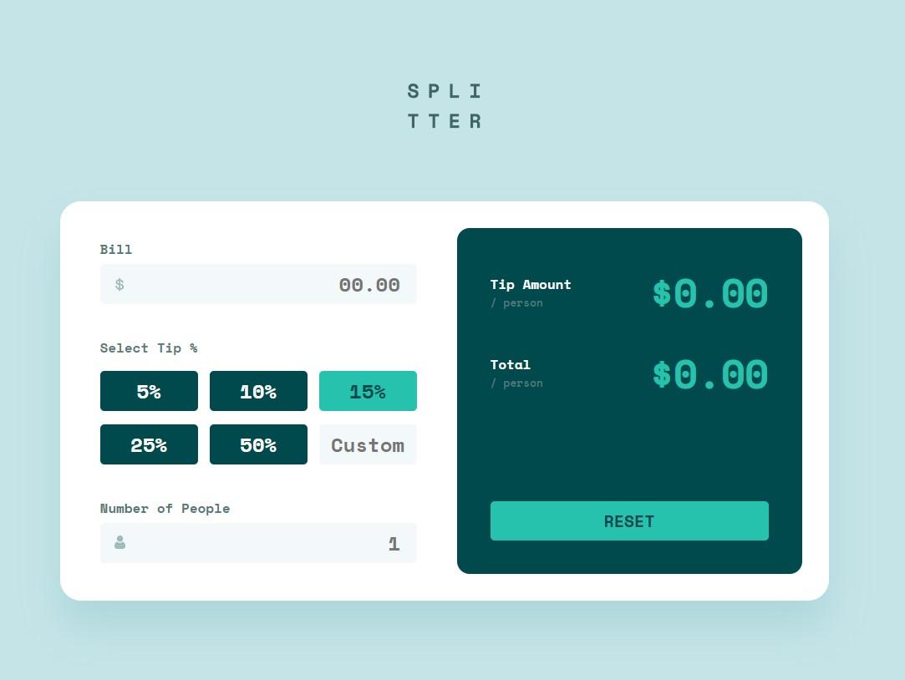
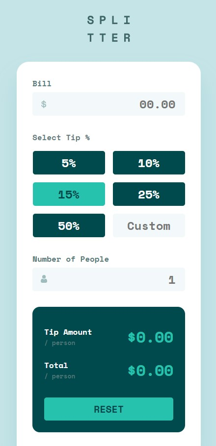

### Screenshot





### Built with

- Semantic HTML5 markup
- CSS custom properties
- Flexbox
- CSS Grid
- Mobile-first workflow
- JavaScript


### What I learned

```js

use closest

parentContainer.addEventListener('click', (e) => {

  const buttonElem = e.target.closest('button')
  const inputElem = e.target.closest('input')

  if (inputElem) {

    setInputElem(inputElem)

    if(inputElem.id === 'custom') {
      cleanButtonClass()
    }
  }

  if (buttonElem) {
    setButtonElem(buttonElem)
    customInput.value = ''
  }

  if (buttonElem === null || inputElem === null) {
    e.stopPropagation()
    return
  }
})
```


## Author

- Frontend Mentor - [@yourusername](https://www.frontendmentor.io/profile/frontend-en)
